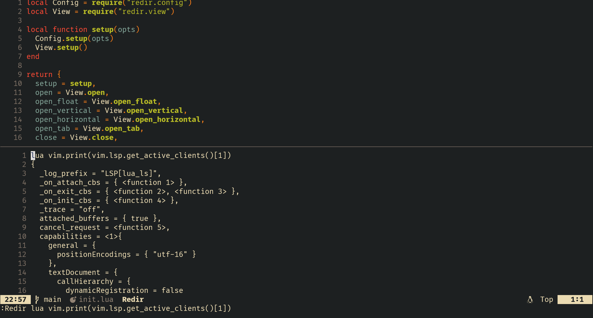

<!-- markdownlint-disable MD013 -->

# Redir

Redirects neovim's [cmdline](https://neovim.io/doc/user/cmdline.html) output to a modifiable buffer.

## Motivation

Neovim's native [hit-enter prompt](https://neovim.io/doc/user/message.html#hit-enter-prompt) does not allow text copying. [redir.nvim](https://github.com/xudyang1/redir.nvim) provides flexibility for text manipulation of neovim's output (copying error messages, debugging info, and etc).



## Features

- flexible layouts: vertical/horizontal split, floating window, tab window
- switch between layouts
- quick copying, editing, and searching of text on the output buffer
- supports all `Ex` commands output

## Requirements

- Latest stable neovim (v0.10.3)

## Installation

- [lazy.nvim](https://github.com/folke/lazy.nvim)

```lua
return {
  "xudyang1/redir.nvim",
  cmd = "Redir",
  opts = {
    -- your configuration options...
    -- leave it empty to use the default settings
    -- refer to the configuration section below
  }
}
```

## Configuration

### A complete list of configuration options and default values

```lua
---@class RedirOptions
---@field global_config? RedirGlobalConfig Global configuration
---@field layout_config? RedirLayoutConfigs Layout specific configuration, overwrites global_config for each layout style
{
  ---@class RedirGlobalConfig
  ---@field buffer_name? string Buffer name displayed
  ---@field default_layout? LayoutStyle Output window layout style
  ---@field output_format? RedirOutputFormat By default, input cmd is inserted as a header.
  ---@field attach? fun(burnr: integer) Called after opening the redir buffer
  global_config = {
    buffer_name = "Redir",
    default_layout = Constants.LayoutStyle.horizontal,
    ---@class RedirOutputFormat
    ---@field header? SeparatorWrapper Content separator before each output body
    ---@field footer? SeparatorWrapper Content separator after each output body
    output_format = {
      ---@alias Separator string | fun(opts: table): string?
      ---@class SeparatorWrapper
      ---@field enabled? boolean Enable or disable the separator
      ---@field separator? Separator Content of the separator
      header = {
        enabled = true,
        ---@param opts table A single table argument used in command function from vim.api.nvim_create_user_command
        separator = function(opts)
          if opts.fargs[1] and string.sub(opts.fargs[1], 1, 1) == "!" then
            return
          end
          return opts.args
        end,
      },
      ---@class SeparatorWrapper
      footer = {
        enabled = false,
        separator = nil,
      },
    },
    attach = nil,
  },
  ---@class RedirLayoutConfigs
  ---@field vertical? RedirLayoutVertical Vertical layout style options
  ---@field horizontal? RedirLayoutHorizontal Horizontal layout style options
  ---@field float? RedirLayoutFloat Floating layout style options
  ---@field tab? RedirLayoutTab Tab layout style options
  layout_config = {
    ---@class RedirLayoutVertical
    ---@field width? number Percentage of screen width if value <= 1; or, number of columns if width > 1
    ---@field attach? fun(burnr: integer) Called after opening the redir buffer
    vertical = {
      width = nil,
    },
    ---@class RedirLayoutHorizontal
    ---@field height? number Percentage of screen height if value <= 1; or, number of lines if height > 1
    ---@field attach? fun(burnr: integer) Called after opening the redir buffer
    horizontal = {
      height = nil,
    },
    ---@class RedirLayoutFloat
    ---@field win_opts? WinConfig Partial of vim.api.keyset.win_config, @see nvim_open_win
    ---@field attach? fun(burnr: integer) Called after opening the redir buffer
    float = {
      ---@alias BorderCharArray string[] A char array of length 8 or any divisor of 8 @see |nvim_open_win()|
      ---@alias BorderStyle "none" | "single" | "double" | "rounded" | "solid" | "shadow" | BorderCharArray
      ---@class WinConfig
      ---@field width? number Percentage of screen width if value <= 1; or, number of columns if width > 1
      ---@field height? number Percentage of screen height if value <= 1; or, number of lines if height > 1
      ---@field border? BorderStyle Set border style @see :help nvim_open_win() for detail
      ---@field title? string | fun(): string Set a custom title of the floating window
      ---@field title_pos? "left" | "center" | "right" Position of title
      win_opts = {
        width = 0.6,
        height = 0.6,
        border = "rounded",
        title = "Redir Message",
        title_pos = "center",
      },
    },
    ---@class RedirLayoutTab
    ---@field attach? fun(burnr: integer) Called after opening the redir buffer
    tab = {},
  },
}
```

## Usage

### Recommended Configuration

```lua
return {
  "xudyang1/redir.nvim",
  lazy = true,
  cmd = "Redir",
  keys = {
    { "<Leader>re", function() require("redir").open() end, desc = "Redir: open win" },
    { "<Leader>rr", function() require("redir").toggle() end, desc = "Redir: toggle" },
    { "<Leader>rh", function() require("redir").open_horizontal() end, desc = "Redir: open horizontal" },
    { "<Leader>rv", function() require("redir").open_vertical() end, desc = "Redir: open vertical" },
    { "<Leader>rf", function() require("redir").open_float() end, desc = "Redir: open float" },
    { "<Leader>rt", function() require("redir").open_tab() end, desc = "Redir: open tab" },
    { "<Leader>rc", function() require("redir").close() end, desc = "Redir: close win" },
    { "<Leader>rC", function() require("redir").clear() end, desc = "Redir: clear" },
  },
  opts = {},
},
```

### API

```lua
local redir = require("redir")

redir.open() -- open redir window
redir.toggle() -- toggle redir window
redir.open_horizontal() -- open horizontal view
redir.open_vertical() -- open vertical view
redir.open_float() -- open float view
redir.open_tab() -- open tab view
redir.close() -- close redir window
redir.clear() -- clear redir buffer
```
